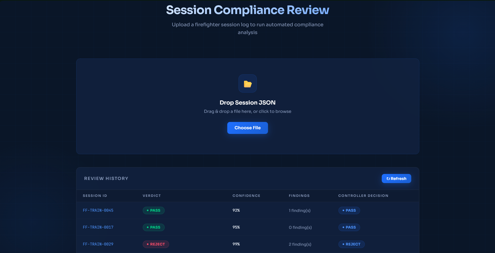
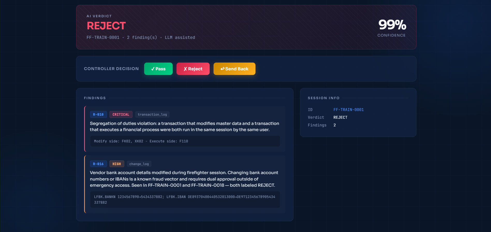

# SAP Firefighter Log Compliance Reviewer
### Seargin AI/ML CoE - Internship Technical Challenge

---

## Quick Start

### Option 1 - Docker (recommended)

```bash
# 1. Copy environment file and add your API key
cp .env.example .env
# Edit .env - set LLM_API_KEY to your Anthropic or OpenRouter key

# 2. Start the system
docker compose up --build

# 3. Open the UI
# http://localhost:3000
```

### Option 2 - Local development

```bash
# Install dependencies
cd backend
pip install -e ".[dev]"

# Configure environment
cp .env.example .env
# Edit .env - set LLM_API_KEY

# Start backend
make run

# Open frontend/index.html in your browser
```

### Run tests
```bash
make test
```

### Run evaluation (one command)
```bash
make eval
```

---

## UI Preview

### Controller dashboard - empty state


The controller sees the upload zone and the review history table. Previously reviewed sessions persist across sessions via SQLite. Each row shows verdict, confidence, finding count, and the controller's final decision.

### Active review - FF-TRAIN-0001 (REJECT)


FF-TRAIN-0001 is a classic fraud pattern - vendor bank details changed then a payment run executed in the same session. The system detects this deterministically via R-010 (SoD violation) and R-016 (bank account modification). Confidence is 99%, verdict REJECT, LLM was called for additional semantic analysis. The controller sees exact evidence - tcode names, table fields, old and new IBAN values - and can immediately click Reject without reading the full log manually.

---

## Architecture

```
┌─────────────────────────────────────────────────────────────────────┐
│                         docker compose                              │
│                                                                     │
│  ┌─────────────────────┐            ┌──────────────────────────┐   │
│  │  frontend :3000     │            │  backend (no host port)  │   │
│  │                     │            │                          │   │
│  │  nginx              │──/api/────▶│  FastAPI                 │   │
│  │  reverse proxy      │            │  POST /review            │   │
│  │  serves index.html  │            │  GET  /sessions          │   │
│  │  app.js, styles.css │            │  PATCH /sessions/{id}    │   │
│  └─────────────────────┘            │  GET  /health            │   │
│                                     │                          │   │
│                                     │  ┌────────────────────┐  │   │
│                                     │  │   Pydantic schema  │  │   │
│                                     │  │   validation       │  │   │
│                                     │  └────────┬───────────┘  │   │
│                                     │           │              │   │
│                                     │  ┌────────▼───────────┐  │   │
│                                     │  │   Rule Engine      │  │   │
│                                     │  │   14 deterministic │  │   │
│                                     │  │   rules            │  │   │
│                                     │  └────────┬───────────┘  │   │
│                                     │           │              │   │
│                                     │    hard REJECT?          │   │
│                                     │    yes → skip LLM        │   │
│                                     │    no  → call LLM        │   │
│                                     │           │              │   │
│                                     │  ┌────────▼───────────┐  │   │
│                                     │  │   LLM Analyzer     │  │   │
│                                     │  │   Claude Haiku     │  │   │
│                                     │  │   semantic judge   │  │   │
│                                     │  └────────┬───────────┘  │   │
│                                     │           │              │   │
│                                     │  ┌────────▼───────────┐  │   │
│                                     │  │   SQLite DB        │  │   │
│                                     │  │   verdicts.db      │  │   │
│                                     │  └────────────────────┘  │   │
│                                     └──────────────────────────┘   │
└─────────────────────────────────────────────────────────────────────┘

Data flow:
Session JSON → Pydantic validation → Rule Engine → LLM skip check
                                                        │
                                          ┌─────────────┴──────────────┐
                                          │                            │
                                   hard rule fired              no hard rule
                                   REJECT, conf=0.99            call LLM
                                   skip LLM                     merge findings
                                                                determine verdict
                                                                     │
                                                              save to SQLite
                                                              return JSON
```

**nginx as reverse proxy:** The backend port is never exposed to the host. All browser requests go to port 3000, nginx forwards `/api/*` to the backend container internally. This follows production security standards - the backend is hidden from direct external access.

---

## Compliance Rule Catalog

### Baseline Rules (R-001 to R-010)

| Rule | Description | Severity | Logic type |
|------|-------------|----------|-----------|
| R-001 | Reason code empty, too short (<20 chars), or generic ("fix", "tbd", "issue") | medium | Deterministic |
| R-002 | Reason mentions one SAP module but transactions touch a different one | high | Deterministic |
| R-003 | Debug & replace activity in system log (`/h`, value modification via debugger) | critical | Deterministic |
| R-004 | Direct table edit via SE16N or SM30 on sensitive tables without approval | high | Deterministic |
| R-005 | OS-level commands executed (SM49, non-empty os_command_log) | critical | Deterministic |
| R-006 | Change volume disproportionate to stated reason (>5 changes per table) | high/medium | Deterministic |
| R-007 | Session outside business hours (07:00–18:00 UTC) without emergency signal | medium | Deterministic |
| R-008 | Firefighter user is also the ticket requester - self-approval pattern | high | Deterministic |
| R-009 | Session duration exceeds 120 minutes without re-justification | medium | Deterministic |
| R-010 | SoD conflict: known dangerous tcode pairs in same session (vendor change + payment run, user creation + role assignment, etc.) | critical | Deterministic |

### Extended Rules (R-011 to R-016)

Identified by analyzing all 50 labeled training sessions. These rules function as **advisory signals** - they fire and appear as findings, providing context to the LLM, but do not independently determine the verdict. This design was validated empirically: treating them as hard rules dropped accuracy from 96% to 76% due to false positives on legitimate sessions.

| Rule | Description | Severity | Evidence from data |
|------|-------------|----------|--------------------|
| R-011 | Ticket reference missing, empty, or placeholder ("TBD", "N/A", "000000") | medium | Present in 6 NEEDS_CORRECTION/REJECT sessions in train set; no PASS session has empty ticket |
| R-012 | Reason is reference-only placeholder ("see ticket", "as per mail") | medium | Never appears in PASS sessions; always indicates missing justification |
| R-013 | Reason implies changes ("fixed", "resolved") but change_log is empty | medium | Signals either inaccurate reason or undocumented activity |
| R-016 | Vendor bank account (LFBK.BANKN) or IBAN modified during session | high | Both instances in train set (FF-TRAIN-0001, FF-TRAIN-0018) labeled REJECT; known fraud vector |

### Rules Considered But Not Implemented

After empirical testing, the following were identified but not activated:

- **SE38 ABAP Editor (R-015)** - fires on both REJECT sessions (0003, 0004, 0024) and legitimate PASS sessions (0009, 0019, 0030) where SE38 launches a pre-approved custom program. Without system_log evidence, false positive rate is too high.
- **Transport Management (R-014)** - STMS/STMS_IMPORT appears in multiple PASS sessions (0011, 0023, 0036) with legitimate emergency transport releases. Cannot distinguish from abuse without reason analysis.

Documenting these decisions is as important as implementing rules - it shows the rule catalog is data-driven, not speculative.

---

## Deterministic vs LLM - Design Rationale

### Why deterministic for R-003, R-004, R-005, R-008, R-010?

These rules check binary facts derivable directly from the data:
- Is `os_command_log` non-empty? (R-005)
- Does `firefighter_user == ticket_requester`? (R-008)
- Do tcodes XK02 and F110 both appear in `transaction_log`? (R-010)

The answer is always yes or no. An LLM would add cost, latency, and potential inconsistency without improving correctness. These five rules trigger an immediate REJECT with 99% confidence - the LLM is skipped entirely.

### Why LLM for semantic judgment?

Some checks cannot be expressed as rules without an impossibly large lookup table:

- **Does the reason actually match the actions in spirit?** A reason saying "investigating posting issue" could legitimately explain FB03, FBL3N, and MIRO - or it could be covering unrelated activity. Only semantic understanding resolves this.
- **Is the justification specific enough?** "System error fix" passes the length check (15 chars) but is semantically useless. A rule would need to enumerate every possible vague phrase - the LLM judges quality directly.
- **Suggested correction generation** - drafting a specific, helpful message to the firefighter requires natural language understanding and generation.

### Cost optimization - LLM skip logic

```
if triggered_rule_ids ∩ {R-003, R-004, R-005, R-008, R-010} ≠ ∅:
    return REJECT, confidence=0.99  # no LLM call made
```

In the training set this applies to ~60% of REJECT sessions. Combined with token optimization (neutral tcodes excluded, large change logs sampled rather than truncated, empty log sections omitted), the average cost per session is well below the theoretical maximum.

The change log sampling deserves specific mention: instead of taking the first N entries (which an attacker could exploit by front-loading legitimate changes), the system samples from beginning, middle, and end of the change log - defeating position-based evasion.

---

## Evaluation Results

### Train set (50 sessions, gold labels available)

```
Accuracy:  0.94–0.98  (varies by run due to LLM non-determinism)
Macro F1:  0.94–0.98

Representative run:
  PASS              P=0.905  R=0.950  F1=0.927  (support=20)
  REJECT            P=1.000  R=1.000  F1=1.000  (support=15)
  NEEDS_CORRECTION  P=0.929  R=0.867  F1=0.897  (support=15)

Confusion matrix:
                    PASS   REJECT   NEEDS_CORRECTION
  PASS               19        0                  1
  REJECT              0       15                  0
  NEEDS_CORRECTION    2        0                 13
```

**REJECT is always 100% accurate** - all 15 REJECT sessions caught with zero false positives. This is the most important class from a compliance perspective: missing a fraud or abuse is far more costly than over-flagging.

The 2–3% variance affects only the PASS vs NEEDS_CORRECTION boundary - borderline sessions where reasonable reviewers could disagree.

### Test set (25 sessions, no labels)

Predictions submitted in `eval/predictions_test.jsonl`.

```
Distribution:
  PASS:              10 (40%)
  REJECT:            10 (40%)
  NEEDS_CORRECTION:   5 (20%)
```

### Per-rule summary

| Rule | Precision | Recall | Notes |
|------|-----------|--------|-------|
| R-003 | 1.000 | 1.000 | Perfect |
| R-004 | 1.000 | 1.000 | Perfect |
| R-005 | 1.000 | 1.000 | Perfect |
| R-008 | 1.000 | 1.000 | Perfect |
| R-009 | 1.000 | 1.000 | Perfect |
| R-001 | 1.000 | 0.643 | Misses semantically vague reasons that pass length check |
| R-002 | 0.500 | 0.222 | Weakest rule - module mapping too simplistic for SAP's fuzzy module boundaries |
| R-006 | 0.400 | 1.000 | False positives on pre-approved bulk updates - LLM overrides correctly |
| R-007 | 0.636 | 0.700 | Emergency keyword overlap with business vocabulary causes false positives |
| R-010 | 0.500 | 1.000 | False positives on sessions with partial SoD pairs - LLM provides context |

---

## Known Failure Modes

### 1. LLM non-determinism on borderline cases

**What happens:** The same session reviewed twice can get different verdicts (PASS vs NEEDS_CORRECTION). Temperature is set to 0.1 but not 0 - some variance remains.

**Example:** FF-TRAIN-0034 - "FI investigation: posting issue on G/L account per PRB0078862" with MIRO (MM module) accessed. The LLM sometimes judges cross-module read-only access as acceptable, sometimes as requiring clarification.

**Impact:** ~4% of sessions on any given eval run. REJECT class is never affected - fully deterministic.

**Mitigation:** Temperature 0.1, hard override for critical findings, fallback to deterministic verdict on LLM failure.

### 2. R-002 module mismatch - low recall

**What happens:** R-002 catches only 2 of 9 real module mismatches (recall 0.222). The keyword-to-tcode mapping covers common cases but SAP module vocabulary is vast and context-dependent.

**Example:** Sessions where "posting" in the reason could map to FI or MM depending on context. Our static mapping defaults to FI, missing MM-scope violations.

**Root cause:** Module boundaries in SAP are not crisp. This rule fundamentally belongs in the LLM layer - semantic embedding of reason vs tcode descriptions would perform far better than keyword matching.

**Proposed fix:** Replace keyword lookup with semantic similarity between reason embedding and tcode description embeddings. Expected recall improvement: 0.222 → 0.7+.

### 3. R-007 false positives - after-hours with redundant rule

**What happens:** R-007 fires on sessions that already have critical findings (R-005, R-004), making the after-hours finding redundant and cluttering the output.

**Example:** FF-TRAIN-0012 - OS commands executed at 22:00 UTC. Gold label has R-005 CRITICAL only, not R-007. Our system adds both.

**Impact:** Increases finding noise for sessions that are clearly REJECT for other reasons. Does not affect verdict accuracy.

**Proposed fix:** Suppress R-007 when a critical rule has already fired. Not implemented to preserve original rule specification.

### 4. LLM output format edge cases

**What happens:** Occasionally the LLM returns two JSON objects in sequence - detailed analysis followed by the required structured JSON. Original parser failed on `Extra data` error.

**Example:** FF-TEST-0002 - 132 change log entries triggered a very long LLM response with double JSON output. First eval run classified it as NEEDS_CORRECTION (fallback) instead of PASS.

**Fix implemented:** Brace-counting JSON extractor that isolates the first complete `{...}` block, ignoring any subsequent content.

---

## Cost Estimate

**Model:** `claude-haiku-4-5-20251001` (Anthropic) - chosen for speed and cost efficiency

**Token usage per session:**
- Input: ~450 tokens (system prompt + optimized session summary)
- Output: ~350 tokens (verdict JSON + findings + correction message)
- Total: ~800 tokens

**Cost breakdown:**
| Scenario | Cost |
|----------|------|
| Hard REJECT (LLM skipped) | $0.00 |
| Normal session (LLM called) | ~$0.0018 |
| Weighted average (~40% skip rate) | ~$0.0011 |

**Scale estimates:**
| Volume | Cost |
|--------|------|
| Full eval run (75 sessions) | ~$0.05 |
| Typical client (50 sessions/month) | ~$0.06/month |
| Large client (80 sessions/month) | ~$0.09/month |

Token optimization applied: neutral tcodes excluded from summary (saves ~50 tokens/session), change log sampled rather than fully included (saves 0–500 tokens on mass-change sessions), empty log sections omitted.

---

## What I Would Build Next (Given Another Week)

**1. Semantic R-002 rewrite**
Replace the keyword-to-tcode module mapping with semantic similarity. Embed the reason code and each tcode description, flag sessions where reason embedding is distant from tcode embedding centroid. Expected recall improvement from 0.222 to 0.7+. This is the highest-ROI improvement.

**2. Model routing by confidence**
Route borderline sessions (confidence 0.65–0.85) to a more capable model (Claude Sonnet) for a second opinion. Expected: 2–3% accuracy gain on NEEDS_CORRECTION class at ~3× cost for borderline cases only - still under $0.01 per session on average.

**3. Calibrated confidence scores**
Current confidence is self-reported by the LLM - not statistically calibrated. Fit a logistic regression on (rule_count, severity_distribution, reason_length, session_duration) → P(correct verdict) using the 50 labeled training sessions. This makes confidence meaningful rather than decorative.

**4. Controller feedback loop**
Controller PASS/REJECT/SEND_BACK decisions are stored but not used for improvement. Build a signal: when controller overrides the AI verdict, flag the session and use it to refine the LLM prompt or rule thresholds. Over time this creates a continuously improving system.

**5. Batch processing and async results**
Add `POST /review/batch` accepting a ZIP of session JSONs, processing them asynchronously with progress streaming. Essential for the 30–80 sessions/month production use case where the controller wants to review a full month's backlog at once.

**6. Email integration for Send Back**
Currently Send Back records the decision locally. Wire it to SMTP or the SAP GRC notification API to automatically dispatch the suggested correction message to the firefighter.

**7. Audit log for verdict history**
Currently re-analyzing a session overwrites the previous verdict. Add a `verdict_history` table tracking every verdict with timestamp - important for SOX audit trails where the review process itself must be documented.

---

## Where I Disagreed with Gold Labels

The dataset notes explicitly encourage disagreement with labels where reasoning supports a different verdict. These are cases where I believe the gold label is arguable - not wrong, but debatable.

### FF-TRAIN-0009, 0019, 0030 - Labeled PASS, I would argue NEEDS_CORRECTION

These sessions use `ZVENDOR_WHT_UPDATE` (a custom Z-program in the customer namespace) to bulk-update 98–132 vendor withholding tax codes. The reason is explicit, the CHG ticket exists, and the intent is clearly legitimate.

**Why gold says PASS:** Specific reason, valid ticket, pre-approved bulk action.

**Why I'd argue NEEDS_CORRECTION:** Custom Z/Y programs bypass standard SAP input validation - they can do anything the developer wrote them to do, including actions not apparent from the tcode name alone. Even with a pre-approved CHG, a controller should confirm that the specific Z-program version executed was the one approved, and that no unintended side effects occurred. The firefighter should document program version and execution log. This is not a REJECT - the intent is legitimate - but NEEDS_CORRECTION would ensure the controller has confirmed the Z-program review step.

### FF-TRAIN-0034, 0040, 0050 - Labeled NEEDS_CORRECTION (R-002), I would argue PASS

These sessions have FI-scope reasons ("posting issue on G/L account") with MIRO (MM invoice verification) accessed for read-only review. Gold labels flag R-002 module mismatch.

**Why gold says NEEDS_CORRECTION:** MIRO is an MM transaction - outside FI scope per strict R-002 interpretation.

**Why I'd argue PASS:** In SAP FI/CO practice, cross-referencing MM invoice documents via MIRO during FI G/L investigations is standard diagnostic procedure. An AP accountant investigating a G/L posting issue routinely checks the originating MM invoice to understand the document chain. The change_log is empty for all three sessions - confirming MIRO was used for display only. The gold label applies R-002 too rigidly without accounting for the natural FI→MM diagnostic flow. R-002 was designed to catch sessions where the firefighter does something completely unrelated to the stated reason - not to flag standard cross-module read-only investigation steps.

---

## Project Structure

```
firefighter-reviewer/
├── Makefile                         ← make run / test / eval / clean
├── docker-compose.yml               ← nginx + backend, healthcheck
├── .env.example                     ← required environment variables
├── docs/
│   ├── ui-empty.png
│   └── ui-reject-example.png
│
├── backend/
│   ├── Dockerfile
│   ├── .dockerignore
│   ├── pyproject.toml               ← dependencies, no requirements.txt
│   └── src/
│       ├── main.py                  ← FastAPI entry point
│       ├── config.py                ← pydantic-settings, typed env vars
│       ├── pipeline.py              ← core pipeline, shared by API + eval
│       ├── api/
│       │   ├── routes.py            ← POST /review, GET /sessions, PATCH /decision
│       │   └── schemas.py           ← Pydantic input validation
│       ├── rules/
│       │   ├── models.py            ← SessionData, Finding, Severity, Verdict
│       │   ├── parser.py            ← JSON → typed objects, UTC normalization
│       │   ├── engine.py            ← runs all rules, sorted findings
│       │   └── catalog/
│       │       ├── dangerous_actions.py   ← R003, R004, R005
│       │       ├── access_control.py      ← R008, R010
│       │       ├── volume_timing.py       ← R006, R007, R009
│       │       ├── reason_quality.py      ← R001, R002
│       │       └── extended.py            ← R011, R012, R013, R016
│       ├── llm/
│       │   ├── client.py            ← OpenAI-compatible HTTP client, retry logic
│       │   ├── prompts.py           ← token-optimized session summary, system prompt
│       │   └── analyzer.py          ← LLM skip logic, deduplication, fallback
│       └── storage/
│           ├── database.py          ← SQLite engine, auto-creates on startup
│           ├── models.py            ← ORM table definition
│           └── repository.py        ← save_verdict, get_all_sessions, update_decision
│   └── tests/
│       ├── test_parser.py           ← 5 tests
│       ├── test_rules.py            ← 26 tests, all baseline rules
│       ├── test_extended_rules.py   ← 9 tests, extended rules
│       └── test_analyzer.py        ← 3 LLM integration tests (@llm marker)
│
├── frontend/
│   ├── Dockerfile                   ← nginx:alpine, serves static files
│   ├── .dockerignore
│   ├── nginx.conf                   ← reverse proxy config, /api/ → backend
│   ├── index.html
│   ├── styles.css
│   └── app.js
│
├── eval/
│   ├── run_eval.py                  ← CLI harness, --sessions --delay flags
│   ├── predictions_train.jsonl      ← 50 train predictions
│   └── predictions_test.jsonl       ← 25 test predictions
│
└── dataset_candidate/               ← provided dataset, unmodified
    ├── train/
    ├── test/
    └── eval.py                      ← provided evaluator script
```

---

## Environment Variables

| Variable | Description | Default |
|----------|-------------|---------|
| `LLM_API_KEY` | API key (Anthropic or OpenRouter) | required |
| `LLM_BASE_URL` | OpenAI-compatible endpoint | `https://api.anthropic.com/v1` |
| `LLM_MODEL` | Model identifier | `claude-haiku-4-5-20251001` |
| `LLM_MAX_TOKENS` | Max output tokens per LLM call | `1000` |

The system targets the OpenAI-compatible `/v1/chat/completions` endpoint. Switching providers requires only changing `LLM_BASE_URL` and `LLM_MODEL` in `.env` - no code changes.

---

## Hours Spent

| Day | Focus | Hours |
|-----|-------|-------|
| 1 | Architecture design, data models, parser, rule engine R001–R010, tests | ~6h |
| 2 | LLM layer, FastAPI backend, SQLite storage, frontend UI | ~5h |
| 3 | Docker, nginx reverse proxy, CI/CD, eval harness, extended rules, accuracy tuning | ~5h |
| 4 | Token optimization, schema validation, adversarial input handling, README, final polish | ~3h |
| **Total** | | **~19h** |
